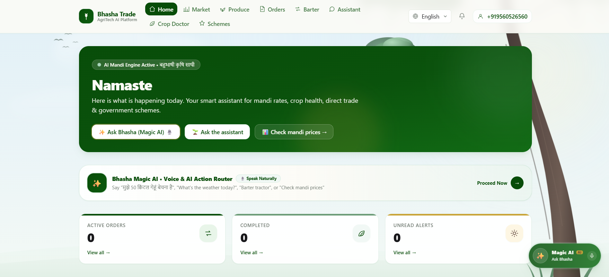
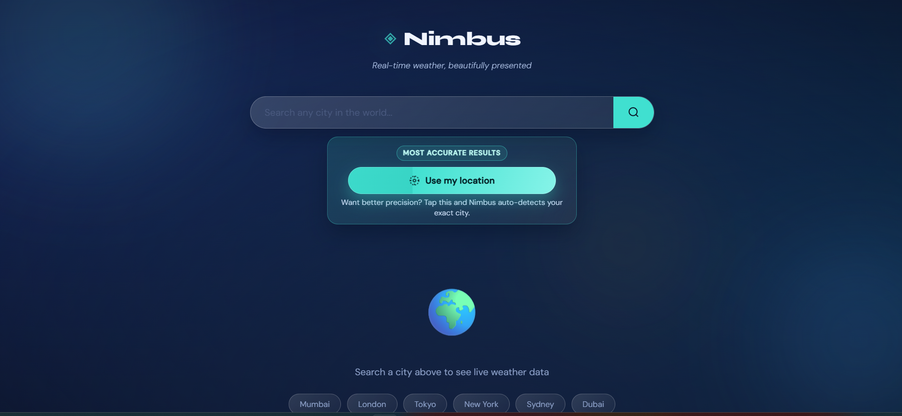
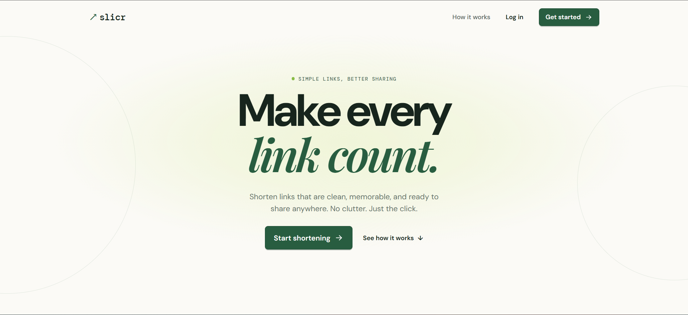

  

 

I'm a full-stack developer who builds secure, production-shaped backends and pairs them with clean React/TypeScript frontends — currently focused on API-first platforms with real auth, rate limiting, and deployment, not just prototypes. Below are the three projects I've made public so far.

 

## 🛠️ Core Technologies

  
  
  
  
  
  
  
  
  
  
  

 

## 🚀 Featured Projects

### 🌾 Bhasha Trade
**Vernacular-first agriculture marketplace & advisory platform.**

A full-stack platform connecting farmers to markets and advisory tools in their own language. FastAPI backend with HMAC-signed tokens and Redis-backed rate limiting, PostgreSQL in production, SQLite for local dev, fully Dockerized. React + TypeScript + Tailwind frontend on Vite.

  
  
  
  
  

  

### ☁️ Nimbus Weather App
**Responsive weather dashboard powered by the OpenWeatherMap API.**

Search by city or use browser geolocation for current conditions plus a 5-day forecast. Built with Flask, hardened with input validation, rate limiting and security headers, and includes its own visitor/search analytics dashboard.

  
  
  
  

  

### 🔗 Slicr — URL Shortener
**Full-stack URL shortener with real authentication, not just redirects.**

Users register, sign in, and create time-limited short links. JWT access tokens paired with rotating, HttpOnly-cookie refresh tokens and Argon2id password hashing. FastAPI + PostgreSQL + SQLAlchemy/Alembic backend, React + Vite frontend.

  
  
  
  

 

## 📈 GitHub Analytics

  
  

 

  

 

## 🐍 Contribution Graph

  

 

